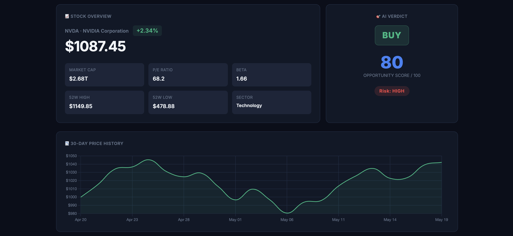
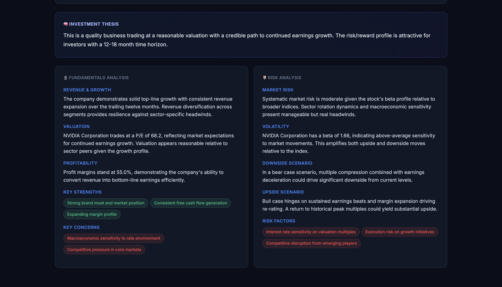
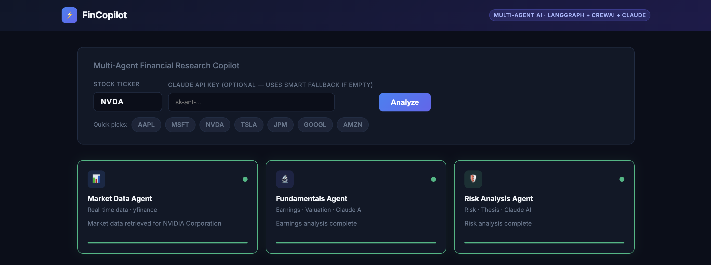

# ⚡ FinCopilot — Multi-Agent Financial Research Copilot

> Autonomously researches any stock using a pipeline of specialized AI agents — delivering investment-grade analysis in seconds.


---

## Overview

FinCopilot orchestrates 3 specialized AI agents that work in sequence to analyze any publicly traded stock — fetching live market data, evaluating earnings and fundamentals, and generating a risk-adjusted investment thesis with a BUY / HOLD / SELL recommendation.

---

## Architecture

```
User Input (Ticker Symbol)
          │
          ▼
┌─────────────────────────────────────────────────────────────┐
│                    LangGraph Orchestrator                    │
│                                                             │
│  ┌─────────────────┐  ┌─────────────────┐  ┌────────────┐  │
│  │  Market Data    │  │  Fundamentals   │  │    Risk    │  │
│  │     Agent       │─▶│     Agent       │─▶│   Agent    │  │
│  │  Yahoo Finance  │  │ CrewAI + Claude │  │CrewAI+Claude│  │
│  └─────────────────┘  └─────────────────┘  └────────────┘  │
└─────────────────────────────────────────────────────────────┘
          │
          ▼
  Real-Time Dashboard (FastAPI + SSE + Chart.js)
```

---

## Tech Stack

| Layer | Tools |
|-------|-------|
| Orchestration | LangGraph, CrewAI |
| AI | Anthropic Claude (claude-sonnet-4) |
| Backend | Python, FastAPI |
| Data | Yahoo Finance API |
| Frontend | HTML, CSS, JavaScript, Chart.js |
| Streaming | Server-Sent Events (SSE) |

---

## Getting Started

```bash
git clone https://github.com/prasadnikita/financial-copilot.git
cd financial-copilot
pip install -r requirements.txt
uvicorn main:app --reload --port 8000
```

Open `http://localhost:8000` in your browser.

> Optionally enter your Anthropic API key in the UI for live AI analysis.
> Get a free key at [console.anthropic.com](https://console.anthropic.com)

---

## Project Structure

```
financial-copilot/
├── main.py                 # FastAPI server + SSE streaming
├── graph.py                # LangGraph pipeline orchestration
├── agents/
│   ├── market_agent.py     # Agent 1 — live market data retrieval
│   ├── crew_agents.py      # CrewAI agent definitions
│   └── research_agent.py   # Agent 2 & 3 — fundamentals and risk analysis
├── static/
│   └── index.html          # Single-page financial dashboard
└── requirements.txt
```

---

## Screenshot





---

## License

MIT